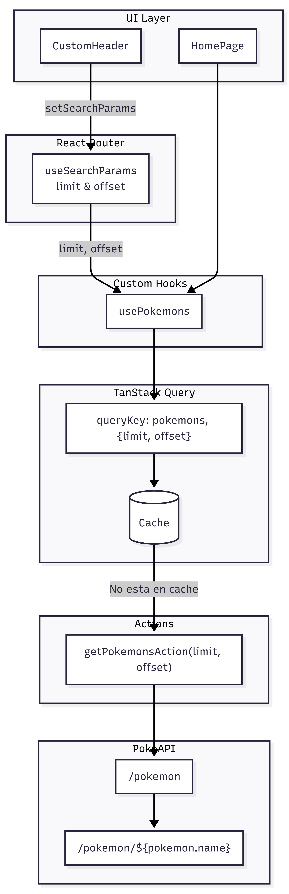
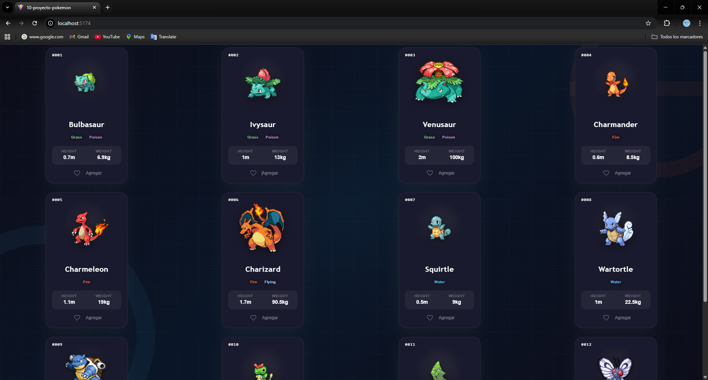
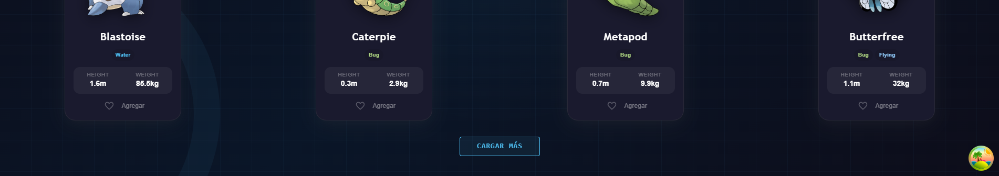
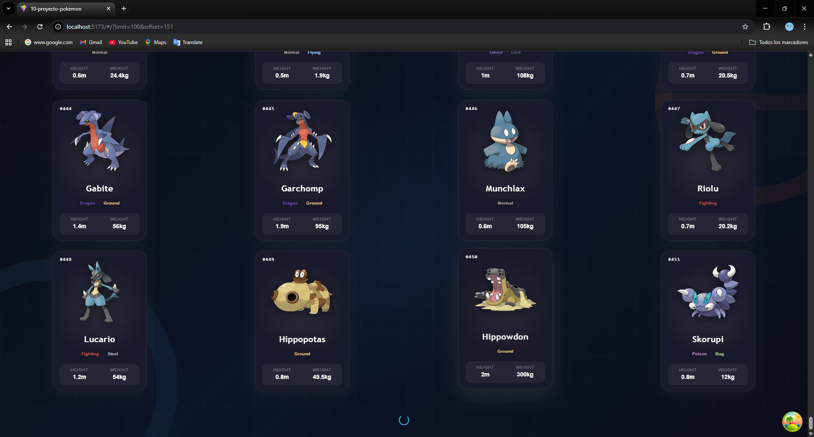
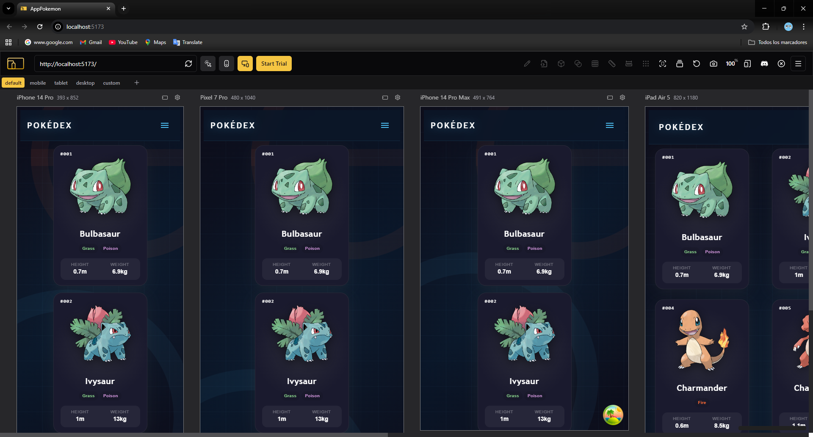

# PokemonApp

Aplicación web para explorar pokémons de todas las generaciones y ver sus estadísticas.

**Demo**(https://poke-app-afaa9.web.app/)

## Instalación

1. Clonar el repositorio
2. Clonar el archivo .env.template y renombrarlo a .env
3. Ejecutar el comando `npm install` para instalar las dependencias

## Uso

1. Ejecutar el comando `npm run dev`

## Diagrama de arquitectura

## Capturas de pantalla

- Pantalla inicial muestra los primeros 12 pokemon
  

- Barra de navegación permite modificar los parametros de limit y el offset cuando se da clic en buscar o se presiona Enter.
  

- Boton de "cargar mas" permite mostrar mas pokemon en la pagina inicial esta alineado con los parametros de limit y offset
  

- Se actualizó el botón de "Cargar más"; ahora se hace la petición cuando se llega al final de la pantalla de manera automática.
  

- Se agrego menú desplegable para pantallas pequeñas
  
