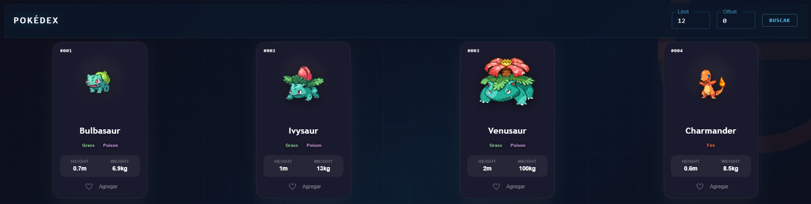

# PokemonApp

## Instalación

1. Clonar el repositorio
2. Clonar el archivo .env.template y renombrarlo a .env
3. Ejecutar el comando `npm install` para instalar las dependencias

## Uso

1. Ejecutar el comando `npm run dev`

## Capturas de pantalla

Pantalla inicial muestra los primeros 12 pokemon

Barra de navegación permite modificar los parametros de limit y el offset cuando se da clic en buscar o se presiona Enter.

